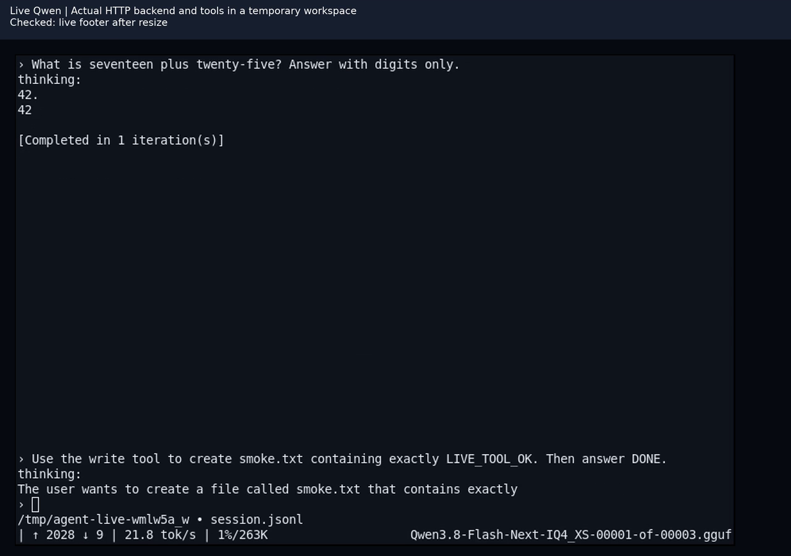

# Terminal test recording

[Watch the video (4:06, MP4)](terminal-tests.mp4)

Recorded on Linux on 2026-09-10 against commit `f93ca6ca8`. The production renderer's PTY output is displayed live in xterm on an isolated Xvfb display and captured with FFmpeg. Captions identify the scenario and assertion; the terminal area is cropped and scaled for readability, and blank gaps between terminal windows are trimmed. This is an automated test run, not manual typing or browser replay footage.

The video shows:

- All 36 `test_terminal.py` scenarios with color disabled, then enabled: editing, Unicode and emoji, paste, completion, streaming, permissions, cancellation, resize down to 1x1, scrollback, terminal cleanup, and image attachment ownership.
- A fresh `test_live.py` run against the existing Qwen server: session resume, arithmetic, resize, tool approval, file creation, and cancellation.
- Fresh command output for the 10 agent CTest suites, AddressSanitizer/UndefinedBehaviorSanitizer terminal checks, and xterm.js browser replay.

Fixture agent events and clipboard bytes are injected. The Qwen segment uses the actual HTTP backend and tools in a temporary workspace. Assertions are made by the existing harness; xterm is the live visual display.

This recording does not verify native Windows/macOS success, operating system clipboard/image protocols, or joined emoji shaping. The initial fork CI run passed Linux terminal tests, failed the Windows build, and timed out in the macOS PTY tests. Those failures require follow-up independently of this Linux recording.

See [the test instructions](../README.md) for reproduction commands.
