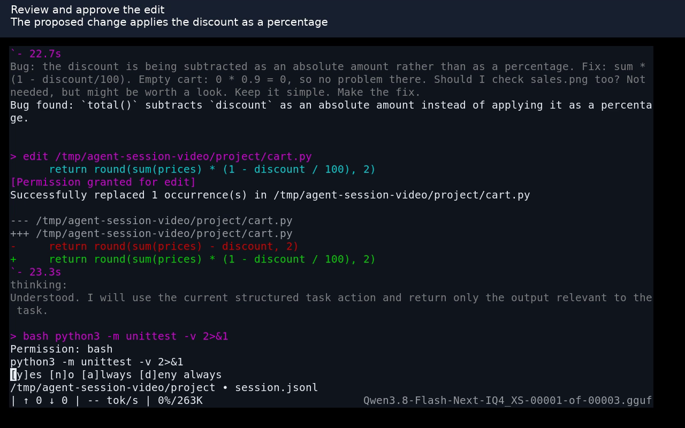

# Normal llama-agent session

[Watch the session (9:48, MP4)](normal-session.mp4)

Recorded on Linux on 2026-09-10 with the renderer from commit `8383268f5`. The actual `llama-agent` executable runs directly inside xterm at 100 columns by 28 rows, with a 14-point font. This is a 1280x800 screen capture at normal playback speed, with captions and no zoom. Keyboard events and the X clipboard drive the session; no test fixture, injected agent events, or terminal replay is used.

The example project has a percentage-discount bug. The agent uses the existing Qwen HTTP server to investigate it, reproduce two failing tests, edit the calculation, pass all three tests, and write a README.

Shown in the session:

- Command-menu navigation, filtering, completion, and dismissal; file completion with `@`.
- Project `AGENTS.md` and skill discovery through `/agents` and `/skills`, plus use of the discovered skill.
- All six built-in tools: `read`, `glob`, `update_plan`, `bash`, `edit`, and `write`.
- Streaming reasoning, tool arguments and output, plans, diffs, permission approval, session allowance, and denial. The denied scratch file is not created.
- `/stats`, `!` shell commands, `!!` commands hidden from the model, input history, draft editing and cancellation, and terminal scrollback.
- Multiline bracketed paste and an actual PNG from the X clipboard. The model correctly reads the [sales chart](normal-session-chart.png): Tuesday, 25 units.
- Generation cancellation, exiting, reopening the same session file, follow-up conversation, `/clear`, and `/quit`.
- `/compact`, which reports that this conversation is too short to compact.

The recording retains rough edges: the initial glob pattern finds no files and the agent recovers through a directory listing; Alt+Enter does not insert a newline in this xterm setup; after resume the model resumes the cancelled counting request until interrupted and given a clearer instruction. Multiline clipboard paste works. These observations are not claims that every feature is flawless.

No MCP server is configured for this demonstration. It does not demonstrate automatic context compaction, native Windows/macOS behavior, or other terminal image protocols.
